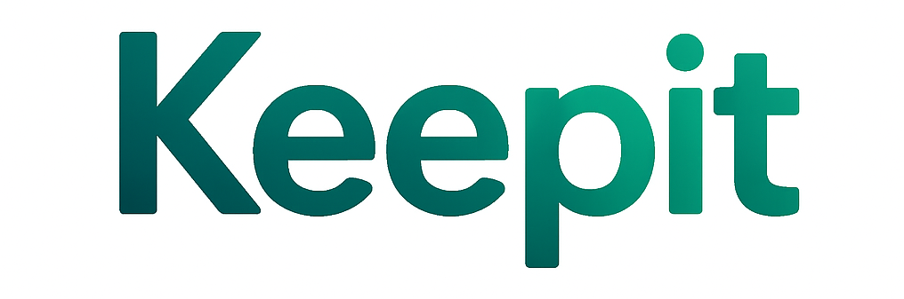

# 내 손 안의 금융 비서 - Keepit (킵잇)

> **SSAFY 13기 대전 2반 10팀 송영지, 이하연**  
> 본 프로젝트는 SSAFY 과정 중 개발된 팀 프로젝트입니다.

<div align="center">



**금융 초보자부터 투자 전문가까지, 모든 사람을 위한 올인원 금융 플랫폼**

[](https://vuejs.org/)
[](https://www.djangoproject.com/)
[](https://www.python.org/)
[](https://developer.mozilla.org/en-US/docs/Web/JavaScript)

</div>

----

## 프로젝트 개요

**Keepit**은 예·적금, 주식, ETF, 현물(금·은) 상품 정보를 한눈에 비교·분석할 수 있는 **올인원** 금융 플랫폼입니다.  

사용자 투자 성향에 따라 **맞춤형 상품을 추천**하고, 주변 은행 위치 검색, 금융 커뮤니티, AI 챗봇 상담 등 폭넓은 기능을 제공합니다.  
금융 초보자부터 투자 고수까지 모두 사용할 수 있도록 직관적 UI와 신뢰도 높은 데이터를 목표로 개발되었습니다.

###  핵심 가치
- **개인화**: AI 기반 투자 성향 분석으로 맞춤형 상품 추천
- **통합성**: 예적금부터 주식, ETF, 현물까지 한 곳에서
- **소통**: 활발한 금융 커뮤니티와 실시간 AI 상담
- **사용성**: 직관적인 UI/UX와 매력적인 로딩 애니메이션

---

## 주요 기능

### 1. AI 기반 투자 성향 분석
- **머신러닝 모델**을 활용한 정확한 투자 성향 테스트
- 개인별 **맞춤형 상품 추천** 시스템
- 테스트 결과 **이메일 전송** 기능
- 시각적 결과 리포트 제공

### 2. 금융 상품 탐색
- 예·적금 금리 비교 및 상세 정보 조회
- 금·은 등 현물 정보 제공
- 주식/ETF 실시간 정보 및 관련 뉴스 제공
- 관심 상품 찜하기

### 3. 찜한 상품 비교하기
- 관심 상품(정기 예금, 적금) **원클릭 찜하기**
- 찜한 상품들의 **이자 분석**

### 4. 금융 커뮤니티
- **자유게시판**: 투자 경험 공유 및 토론
- **질문게시판**: 금융 전문가와 사용자들의 Q&A
- **실시간 좋아요** 및 댓글 시스템
- **팔로우/팔로워** 네트워킹 기능

### 5. 사용자 커스터마이징
- 프로필, 회원 정보 수정
- 팔로우/팔로워 기능

### 6. 은행 찾기
- **Kakao Map API** 연동
- 사용자 주소 위치 기반 **주변 은행 검색**
- 은행별 주소 정보

### 7. 챗봇 상담
- **OpenAI 기반** 실시간 금융 상담
- 홈페이지·금융상품 문의
- 대화 세션 관리

### 8. 사용자 경험 최적화
- **Lottie 애니메이션**으로 매끄러운 로딩 경험
- **반응형 디자인**으로 모든 디바이스 지원
- **직관적인 네비게이션** 및 사용자 인터페이스

---

## 기술 스택

### Frontend
```
Vue 3 + Composition API
├── 🎨 UI/UX: Vue 3, Pinia, Vue Router
├── 📡 HTTP: Axios
├── 🎬 Animation: Lottie Web Vue
├── 🗺️ Maps: Kakao Map API
└── 📱 Responsive: CSS3, Flexbox
```

### Backend
```
Django + DRF
├── 🔐 Authentication: Token-based Auth
├── 🗄️ Database: SQLite (개발)
├── 🤖 AI: OpenAI API
├── 📊 Data: Pandas, NumPy
└── 📧 Email: SMTP (Gmail)
```

### External APIs
```
금융 데이터
├── 💳 예적금: 금융감독원 오픈 API
├── 📈 주식/ETF: 한국투자증권 Open API
├── 🥇 현물: Gold API.io
├── 📰 뉴스: NAVER Developers API
└── 🗺️ 지도: Kakao Map API
```

---

## 폴더 구조
```
Keepit/
├── Keepit_Frontend/           # Vue.js 프론트엔드
│   ├── src/
│   │   ├── components/          # 재사용 가능한 컴포넌트
│   │   ├── views/              # 페이지 컴포넌트
│   │   ├── stores/             # Pinia 상태 관리
│   │   ├── router/             # Vue Router 설정
│   │   └── assets/
│   │       ├── animations/     # Lottie 애니메이션 파일
│   │       ├── data/          # 정적 데이터 (JSON)
│   │       └── images/        # 이미지 리소스
│   └── public/                 # 정적 파일
│
├── Keepit_Backend/            # Django 백엔드
│   ├── users/                  # 사용자 관리
│   ├── products/               # 금융 상품 관리
│   ├── community/              # 커뮤니티 기능
│   ├── chatbot/                # AI 챗봇
│   ├── recommendations/        # ML 기반 추천 시스템
│   ├── news/                   # 뉴스 관리
│   ├── banks/                  # 은행 정보
│   ├── regions/                # 지역 데이터
│   ├── tests/                  # 투자 성향 테스트
│   ├── scripts/                # 데이터 로딩 스크립트
│   └── templates/              # 이메일 템플릿
│
├── docs/                     # 프로젝트 문서
│   ├── 요구사항 명세서
│   ├── API 명세서
│   ├── ERD 다이어그램
│   └── 와이어프레임

```
---

## 설치 및 실행 방법

### 프론트엔드
- `.env.example` 파일 참고해 `.env` 파일 생성 (API Key 관리)
```bash
cd Keepit_Frontend
npm install
npm run dev
```

### 백엔드
- `.env.example` 파일 참고해 `.env` 파일 생성 (API Key 관리)

```bash
cd Keepit_Backend
python -m venv venv
source venv/bin/activate   # Windows: venv\Scripts\activate
pip install -r requirements.txt
python manage.py migrate
python manage.py shell
exec(open('scripts/load_regions.py', encoding='utf-8').read()) # 지역 데이터 등록
exit()
python manage.py runserver
```

---

## 주요 페이지 안내

| URL                              | 설명                                   |
|----------------------------------|----------------------------------------|
| `/home`                          | 메인 홈                                |
| `/products/deposits`             | 정기 예금 상품 정보                    |
| `/products/savings`              | 적금 상품 정보                         |
| `/products/goods`                | 현물(금·은) 정보                       |
| `/products/stocks`               | 주식 정보                              |
| `/products/etfs`                 | ETF 정보                               |
| `/products/compare/deposits`     | 정기 예금 상품 비교                    |
| `/products/compare/savings`      | 적금 상품 비교                         |
| `/banks/nearby`                  | 내 위치 기반 은행 검색                 |
| `/community`                     | 자유게시판/질문게시판                  |
| `/profile`                       | 사용자 프로필 및 성향 설정             |
| `/users`                         | 로그인, 회원가입, 마이페이지 등        |
| `/chatbot`                       | 챗봇 상담                              |
| `/test`                          | 투자 성향 테스트                       |

| **메인 기능** | **URL** | **설명** |
|---|---|---|
| 홈 | `/` | 대시보드 및 주요 기능 접근 |
| 투자 성향 테스트 | `/test` | AI 기반 투자 성향 분석 |
| 테스트 결과 | `/test/result` | 개인화된 투자 추천 결과 |

| **금융 상품** | **URL** | **설명** |
|---|---|---|
| 정기예금 | `/products/deposits`  | 정기 예금/적금 정보 |
| 적금 | `/products/savings`  | 적금 정보 |
| 주식 | `/products/stocks` | 실시간 주식 정보 |
| ETF | `/products/etfs` | ETF 상품 정보 |
| 현물 | `/products/goods`   | 금/은 현물 시세 |
| 정기 예금 비교 | `/products/compare/deposits` | 찜한 정기 예금 비교 분석 |
| 적금 비교 | `/products/compare/savings` | 찜한 정기 예금 비교 분석 |

| **커뮤니티** | **URL** | **설명** |
|---|---|---|
| 자유게시판 | `/community/free` | 투자 경험 공유 |
| 질문게시판 | `/community/question` | 금융 Q&A |

| **사용자** | **URL** | **설명** |
|---|---|---|
| 마이페이지 | `/mypage` | 개인 정보 및 활동 내역 |
| 찜한 상품 | `/my/favorites` | 관심 상품 관리 |
| 은행 찾기 | `/location` | 사용자 주소 기반 은행 검색 |
| AI 상담 | `/chatbot` | 실시간 금융 상담 |
---

## 주요 특징

### 매끄러운 사용자 경험
- **Lottie 애니메이션**: 로딩 시간을 즐거운 경험으로 전환
- **반응형 디자인**: 모바일부터 데스크톱까지 완벽 지원
- **직관적 UI**: 금융 초보자도 쉽게 사용할 수 있는 인터페이스

### 보안 및 인증
- **토큰 기반 인증**: 안전한 사용자 세션 관리
- **로그인 필수 페이지**: 민감한 금융 정보 보호
- **권한 기반 접근 제어**: 사용자별 적절한 권한 관리

### 실시간 데이터
- **실시간 주식 시세**: 한국투자증권 API 연동
- **최신 금리 정보**: 금융감독원 데이터 실시간 반영
- **관련 뉴스**: NAVER API를 통한 최신 금융 뉴스

### AI 기반 서비스
- **투자 성향 분석**: 머신러닝 모델 기반 정확한 분석
- **맞춤형 추천**: 개인 성향에 맞는 상품 추천
- **AI 챗봇**: OpenAI 기반 실시간 금융 상담

---

## 협업 및 Git 전략

- **Git flow** 기반 브랜치 전략
  - `main`: 배포 브랜치
  - `dev`: 개발 통합 브랜치
  - `기능명`: 기능별 개발 브랜치
- **협업 툴**: Notion으로 업무 분배 및 이력 관리
- **디자인**: Figma 와이어프레임 기반 구현

---

## 향후 개선 사항

- 소셜 로그인(OAuth) 연동
- 금융 상품 추천 알고리즘 고도화
- 실시간 채팅 챗봇 기능 강화
- 관리자 대시보드 구축
- 투자 리포트/포트폴리오 기능 추가

---

## 팀 소개

<div align="center">

| 👩‍💻 **송영지** | 👩‍💻 **이하연** |
|:---:|:---:|
| **Backend Developer** | **Frontend Developer** |
| Django, ML, API 연동 | Vue.js, UI/UX, 애니메이션 |
| 투자 추천 알고리즘 개발 | 사용자 경험 최적화 |

</div>

---

## 소감

### 송영지
소감

### 이하연
소감

---

<div align="center">

**🏦 Keepit - 내 손 안의 금융비서**

Made with ❤️ by SSAFY 13기 대전 2반 10팀

</div> 